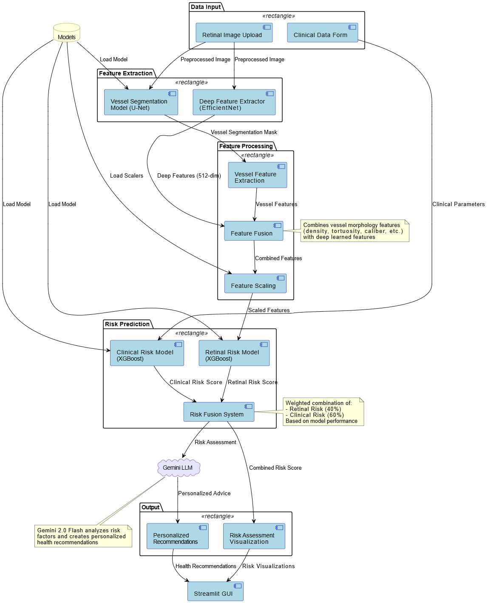

# Cardiovascular Risk Assessment System

## 🚀 Overview

This project is a Streamlit web application designed for cardiovascular risk assessment. It leverages machine learning models to analyze retinal images and clinical data to predict cardiovascular disease (CVD) risk. The system also provides explanations for its predictions and generates personalized recommendations using Google's Generative AI.

## ✨ Features

*   **Retinal Image Analysis:**
    *   Vessel Segmentation: Identifies blood vessels in retinal fundus images.
    *   Feature Extraction: Extracts relevant biomarkers from segmented vessels and retinal images using a custom EfficientNet-based model.
    *   Retinal Risk Prediction: Predicts CVD risk based on retinal features using an XGBoost model.
*   **Clinical Data Analysis:**
    *   Predicts heart failure risk based on clinical parameters using an XGBoost model.
*   **Multi-modal Risk Fusion:** Combines insights from both retinal image analysis and clinical data for a comprehensive risk assessment.
*   **Explainable AI (XAI):** Provides explanations for the risk predictions.
*   **Personalized Recommendations:** Generates actionable advice and lifestyle recommendations using Google's Generative AI based on the risk profile and clinical data.
*   **Interactive User Interface:** Built with Streamlit for easy interaction and data input.

## Architecture:
:

   
## 🛠️ Technologies Used

*   **Python:** Core programming language.
*   **Streamlit:** For building the interactive web application.
*   **TensorFlow & Keras:** For deep learning models (vessel segmentation, retinal feature extraction).
*   **XGBoost:** For machine learning models (retinal and clinical risk prediction).
*   **Scikit-learn:** For machine learning utilities (e.g., scalers).
*   **OpenCV & Scikit-image:** For image processing tasks.
*   **Pandas & NumPy:** For data manipulation.
*   **Matplotlib:** For plotting and image visualization.
*   **Google Generative AI:** For generating explanations and recommendations.
*   **Pillow:** For image handling.
*   **Joblib:** For saving and loading model scalers.
*   **Dotenv:** For managing environment variables.

## ⚙️ Project Structure

```
.
├── .git/
├── .gitignore
├── dataset/              # Placeholder for dataset (if any)
├── docs/                 # Placeholder for documentation
├── main.py               # Main Streamlit application script
├── models/               # Trained ML models and scalers
│   ├── vessel_segmentation_model.keras
│   ├── retinal_cvd_risk_model.json
│   ├── heart_failure_clinical_model.json
│   ├── feature_scaler.pkl
│   └── clinical_feature_scaler.pkl
├── notebooks/            # Jupyter notebooks for experimentation and model training
├── README.md             # This file
├── requirements.txt      # Python dependencies
├── testData/             # Sample test data
└── venv/                 # Python virtual environment (optional)
```

## 📦 Installation

1.  **Clone the repository:**
    ```bash
    git clone <repository-url>
    cd heart_risk_detection_project
    ```

2.  **Create and activate a virtual environment (recommended):**
    ```bash
    python -m venv venv
    # On Windows
    venv\Scripts\activate
    # On macOS/Linux
    source venv/bin/activate
    ```

3.  **Install the dependencies:**
    ```bash
    pip install -r requirements.txt
    ```

4.  **Set up Environment Variables:**
    *   Create a `.env` file in the project root.
    *   Add your Google API key to the `.env` file:
        ```
        GOOGLE_API_KEY="YOUR_GOOGLE_API_KEY"
        ```

## 🚀 Running the Application

1.  Ensure your virtual environment is activated and you are in the project's root directory.
2.  Run the Streamlit application:
    ```bash
    streamlit run main.py
    ```
3.  Open your web browser and navigate to the URL provided by Streamlit (usually `http://localhost:8501`).

## 📊 Models

The application uses several pre-trained models stored in the `models/` directory:

*   `vessel_segmentation_model.keras`: A TensorFlow/Keras model for segmenting blood vessels in retinal images.
*   `retinal_cvd_risk_model.json`: An XGBoost model for predicting CVD risk based on features extracted from retinal images.
*   `heart_failure_clinical_model.json`: An XGBoost model for predicting heart failure risk based on clinical data.
*   `feature_scaler.pkl`: A scikit-learn scaler for retinal image features.
*   `clinical_feature_scaler.pkl`: A scikit-learn scaler for clinical data features.
*   The application also dynamically builds an EfficientNetB3-based model for deep feature extraction from retinal images as an alternative to a full RETFound model.

## 📚 Notebooks

The `notebooks/` directory contains Jupyter notebooks used for:
*   Data exploration and preprocessing.
*   Model training and evaluation.
*   Experimentation with different algorithms and techniques.
*(Details about specific notebooks should be added here if available)*

## 📄 Data

*   The application expects retinal fundus images (e.g., JPG, PNG) as input.
*   Clinical data is entered manually through the Streamlit interface.
*   Sample test images might be found in the `testData/` directory.
*(Details about the training dataset structure and source should be added here if relevant and public)*

## 🤝 Contributing

Contributions are welcome! Please follow these steps:
1.  Fork the repository.
2.  Create a new branch (`git checkout -b feature/your-feature-name`).
3.  Make your changes.
4.  Commit your changes (`git commit -m 'Add some feature'`).
5.  Push to the branch (`git push origin feature/your-feature-name`).
6.  Open a Pull Request.

## 📜 License

*(Specify the license for this project here, e.g., MIT, Apache 2.0. If no license, state "All Rights Reserved" or similar.)*

---

*This README was generated by an AI assistant.* 
